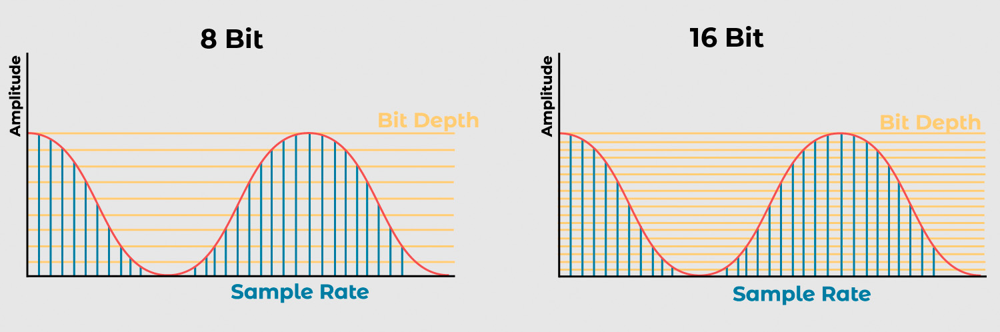

# A savoir sur l'audio

## Oreille humaine
La plage de fréquence audible par l'oreille humaine est d'environ 20 Hz à 20 kHz.


# Audio


## Sample Rate
Taux d'échantillonnage d'un son numérique, par exemple pour un sample rate de 44100 Hz, (axe x)
cela signifie que 44100 échantillons sont enregistrés chaque seconde.

## Bit Depth
Nombre de bits utilisés pour représenter chaque échantillon audio, par exemple 16 bits. (axe y)

## Channels
Nombre de canaux audio, par exemple 1 pour mono et 2 pour stéréo.

## Bitrate
Débit binaire, c'est le nombre de bits utilisés pour encoder une seconde de son.

Calcul du bitrate:
```
bitrate = sampleRate * bitDepth * channels
```
## Aliasing
L'aliasing est un phénomène qui se produit lorsqu'un signal est échantillonné à une fréquence insuffisante.


# Pour aller plus loin

## Nyquist Theorem
Le théorème de Nyquist stipule que pour reproduire correctement une fréquence, il faut un taux d'échantillonnage de deux fois la fréquence maximale de la source.

Donc pour une fréquence maximale de 20 kHz, il faut un taux d'échantillonnage de 40 kHz.

Avec l'exemple de 44100 Hz, cela permet de reproduire des fréquences jusqu'à 22050 Hz.

## Quantification
La quantification est le processus de conversion d'un signal analogique en un signal numérique.
En pratique, cela revient à attribuer une valeur numérique à chaque échantillon audio.
Plus la profondeur de bits est grande, plus la dynamique du signal est grande.
Par exemple, un signal audio de 16 bits a une dynamique de 96 dB.